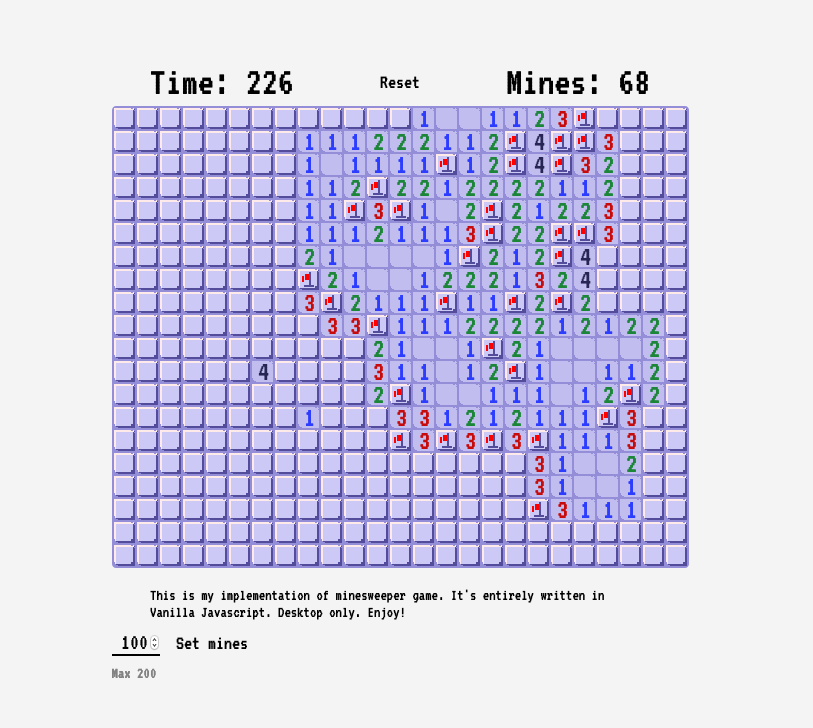

# Minesweeper

A simple implementation of classic minesweeper game. Written entirely in Vanilla Javascript using Canvas API. 
The styling is inspired by retro pixel games.

## Installing / Getting started


```shell
npm install 

npm start    # <--- run development server

npm run build   # <--- create production build in ./dist directory
```


Click on the board and the game will start!

If you decide to change amount of mines, the game will automatically reset.

Beware, desktop only!

## Screenshot




## Links

- Live: https://distracted-kalam-ae17b0.netlify.com/
- Repository: https://github.com/EmilTheSadCat/minesweeper-game
- My other games:
  - Tetris: https://github.com/EmilTheSadCat/tetris-game


## Licensing

The code in this project is licensed under MIT license.
